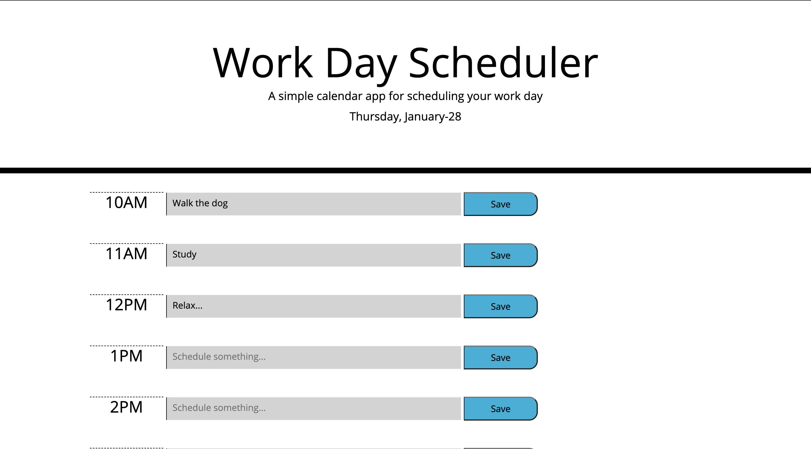

# Homework-5
Work Day Scheduler.

Description:
This is an interactive workday scheduler. It allows user to input events that they want to be part of their daily scheduled. The hour ranges are preselected to be between 10 am and 6 pm. When user clicks "save" button, the input is saved and stays on the page even after refreshing or even leaving and coming back later.

Difficulties with the project:
Surprisingly enough, I though this would be an easy project, however it turrned out to be a bit of a struggle. Concepts like pseudo-code helped out a lot after all. I am still working on my "problem solving thinking". 

Screenshots:

